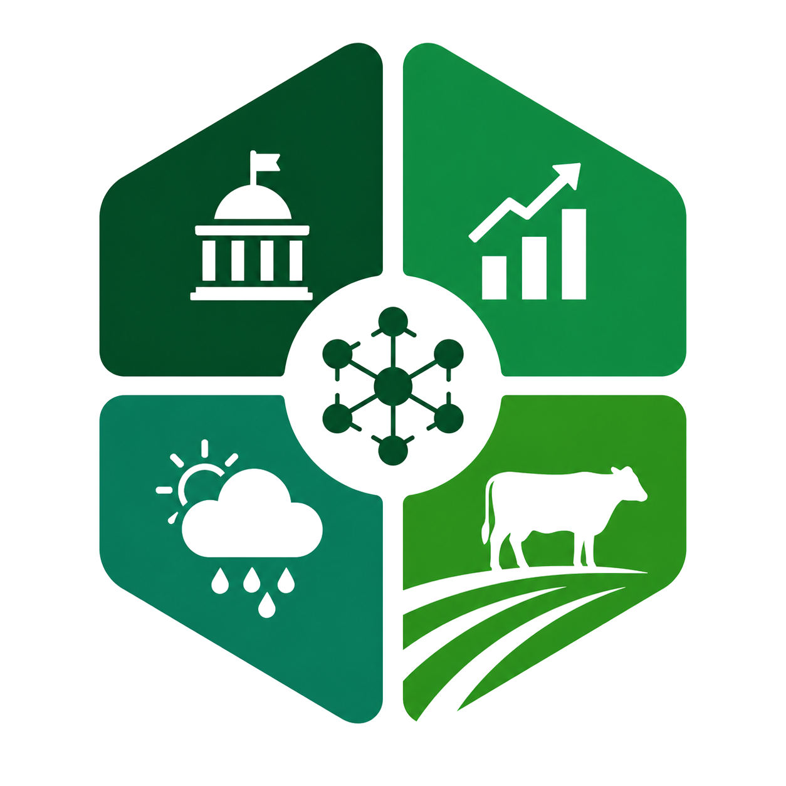

<div align="center">



# VEREDA

**Copiloto de IA para a estratégia de captação de leite cru**

<sub>Desafio · Designer de Soluções Digitais (AI-First) · setor de laticínios</sub>

<br/>


</div>

---

> **O entregável é um link**: o [`index.html`](index.html) na raiz, que abre a landing e dá entrada no sistema. O código componentizado (telas, estilos, dados e motor) vive em [`prototipo/`](prototipo/). Este README é a **trilha de raciocínio** por trás dele: como, partindo de dois arquivos, cheguei a uma solução com nome, escopo, motor, identidade e princípios.
>
> O link mostra o **o quê**. Esta trilha mostra o **porquê**. É munição de defesa, não marketing.

**Com 5 minutos:** leia [a virada](#3-a-virada-da-perecibilidade), [a auto-auditoria](#a-auto-auditoria-do-método) e [a arquitetura de viabilidade](#arquitetura-de-viabilidade).

O ponto de partida foram **dois arquivos**: [`docs/desafio.md`](docs/desafio.md) (o enunciado) e [`docs/vaga.md`](docs/vaga.md) (a vaga). Nenhum stakeholder real, nenhum dataset, nenhum brief adicional. Tudo que segue nasceu daí.

---

# A trilha, em 8 passos

A mesma linha de raciocínio que abre o protótipo (a landing *"Como cheguei aqui"*), aqui com a profundidade técnica que a tela não comporta.

## 1. O ponto de partida

Uma indústria de leite perde margem sempre que o preço oscila. O leite cru é a maior fatia do custo de um laticínio: cada centavo na compra vira muito dinheiro no fim do mês.

O preço se move por **quatro frentes ao mesmo tempo**:

- **Político** (impostos, importação, atos sanitários)
- **Econômico** (câmbio, milho que alimenta o gado, preço internacional)
- **Climático** (seca e chuva mudam a oferta)
- **Agropecuário** (rebanho, qualidade do leite)

O pedido do briefing: cruzar essas frentes com IA para apoiar a decisão de compra.

## 2. Comecei pela pergunta, não pela tecnologia

É fácil aplicar IA a um problema e entregar algo que impressiona na demo e morre no uso. O caminho que sigo é o contrário: **interrogar o problema até achar a alavanca real**, a decisão que, se melhorar, muda o resultado.

Foi essa disciplina que fez uma pergunta incômoda aparecer. Ela reescreveu o produto inteiro.

## 3. A virada da perecibilidade

> *"Leite não é soja. A vaca produz hoje, eu coleto hoje, ou estraga."*
> Anderson, comprador de leite há 20 anos

Soja se compra e se guarda. Leite cru, não: a vaca produz todo dia, o leite precisa ser coletado em horas ou estraga. **Se não dá para esperar o preço cair, o problema real não é prever o preço.**

O que o comprador controla é a **estratégia de captação dos próximos trimestres**:

- de qual bacia puxar volume;
- quando antecipar a conversa com a cooperativa e com o produtor direto;
- como desenhar a bonificação para fidelizar volume antes da entressafra.

O sistema enxerga **os dois lados, cooperativa e produtor**. Essa é a espinha. Por ela, o Vereda **não** é previsor de buy/wait, **não** é hedge financeiro, **não** é CRM de produtor. (Estudo de domínio: [`docs/00-estudo-preliminar.md §2`](docs/00-estudo-preliminar.md).)

## 4. Discovery com personas adversariais

A vaga pede discovery com stakeholders. Eu não tinha stakeholders reais. A resposta a essa restrição é, ela mesma, a demonstração de prompt engineering que a vaga cobra.

Criei **duas personas-subagente**, modeladas a partir de pesquisa do setor (cicatrizes, vocabulário e incentivos reais) e instruídas a **resistir por padrão**:

- [`@anderson-comprador`](.claude/agents/anderson-comprador.md): Gerente de Captação, chão de fábrica e linha de rota.
- [`@patricia-diretora`](.claude/agents/patricia-diretora.md): Diretora de Suprimentos, spread vs. CEPEA e governança.

Elas não validam por validar: opinam, propõem e **discordam** quando a ideia é fraca. Em três rodadas, estressaram tudo, do enquadramento do problema até cada tela. **O que morreu na conversa:**

| Ideia testada | Veredito |
|---|---|
| Realocar volume livremente entre regiões | **Refutada.** Lead time de 60 a 90 dias; ~70% do mix já amarrado em cooperativa. A alavanca real são os ~30% a 35% de produtor direto + spot. |
| Hedge / forward de **preço** | **Não existe** no Brasil. Virou forward de **volume**: *"o ativo mais valioso não é preço travado, é relação travada"* (Anderson). |
| Sinal isolado de preço aciona decisão | **Não.** Patrícia só move algo com qualidade esperada (CCS/CBT) + logística + um trimestre de antecedência. |
| Score de churn 0 a 100 na tela | **Recusado** por Anderson. Vira categoria + motivo + histórico. |

Cada corte de escopo tem uma fala registrada por trás, rastreável em [`docs/discovery/`](docs/discovery/). Veredito consolidado em [`00-sintese.md`](docs/discovery/00-sintese.md).

## 5. Lean Inception: decidir o que não fazer

Saí de **~50 ideias soltas** até um escopo defensável. Usei Lean Inception (visão, é/não é, jornada, brainstorm, sequenciador, canvas de MVP). Os artefatos vivem em [`docs/lean-inception/`](docs/lean-inception/) e servem de munição, não são entregues.

**O princípio de corte.** Uma feature só entrava se passasse, ao mesmo tempo, em três perguntas:

1. resolve uma dor real de quem compra?
2. é defensável na diretoria?
3. não refaz o que a empresa já tem (SAP, Power BI)?

O que não passava virava registro de **fora do escopo, de propósito**: hedge financeiro, CRM de produtor, previsão de demanda. Contrato final em [`07-canvas-mvp.md`](docs/lean-inception/07-canvas-mvp.md).

## 6. Um motor real por trás

Antes de desenhar qualquer tela, conferi se cada peça é **construível de verdade**: existe o modelo, existe a técnica de explicação, existe a fonte de dado pública. Prometer um sistema que não dá para construir é vender sonho, e some na primeira pergunta técnica do Comitê.

Por baixo de cada tela:

- **Forecast** por série temporal (SARIMAX para a sazonalidade safra/entressafra + LightGBM para as interações não-lineares).
- **Explicação** por peso de fator (SHAP sobre a camada de boosting).
- **Copiloto** por uma camada de linguagem (GenAI) que opera sobre os números, sem inventá-los.

O mapa completo tela para motor está na seção [Arquitetura de viabilidade](#arquitetura-de-viabilidade). As fontes reais por pilar, em [Referências](#referências).

## 7. A promessa, sem inflar

`+R$ 0,03 a R$ 0,08 / litro` · `~65% de probabilidade` · `2 trimestres` · `vs. CEPEA`

O ganho não vem de adivinhar o preço. Vem de **antecipar o posicionamento**: alocar volume nas bacias certas antes do pico de entressafra, antecipar a cláusula com a cooperativa, reduzir dependência de spot caro.

Sobre um preço que orbita R$ 2,50/litro, isso é cerca de **1,5% a 3%**. Modesto e crível. Prometer R$ 0,20 seria o tipo de número que a diretora mataria. **Declarar a probabilidade na cara faz parte do produto.**

## 8. O resultado

Um copiloto que vira **quatro frentes de dados em estratégia defensável**: explicável fator a fator, simulável ao vivo, e honesto sobre o que não sabe.

No protótipo, hoje:

- **painel por bacia** com forecast, banda de confiança e semáforo;
- **recomendação** explicada fator a fator pelos 4 pilares;
- **simulador** what-if que recalcula ao vivo;
- **risco de perda de produtor** (por qualidade e por entrega);
- **transparência**: taxa de acerto exposta e fator político em quarentena quando o sinal é fraco;
- **copiloto** que conversa em português.

A marca de maturidade: o Vereda mostra a banda, expõe quando erra e diz onde ainda não confia.

---

# A auto-auditoria do método

A parte mais importante da trilha, e a menos confortável. Depois de fechar o Lean Inception, **auditei meu próprio processo** e encontrei dois vícios. Usar IA com competência inclui conhecer os limites do método.

- **Vício 1: a validação só adicionava, nunca matava.** A última rodada fechou em "0 cortes". Um crítico que só *reformata* escopo (nunca corta) não é adversarial: ele empurra o escopo para cima.
- **Vício 2: validei o objetivo errado.** Simulei *"um laticínio compraria isto?"*. Mas o usuário real do artefato é **um avaliador AI-First, julgando em 5 a 10 minutos**, e esse avaliador nunca foi simulado.

**A lição:** uma persona-LLM resiste a erro de domínio, mas **não a escopo ruim**. São LLMs que eu mesmo escrevi; sem mandato explícito de cortar, tendem a colaborar.

**Como isso mudou o projeto:** a landing *"Como cheguei aqui"* é, literalmente, o artefato desenhado para o avaliador que a discovery nunca simulou. Ela fecha o Vício 2. O veredito da discovery está em [`docs/discovery/00-sintese.md`](docs/discovery/00-sintese.md).

---

# Arquitetura de viabilidade

O protótipo simula a inteligência no front, mas **nada na tela é mágica**. Cada elemento mapeia para um motor de produção construível.

| Na tela (simulado) | Motor real por trás (produção) |
|---|---|
| Recomendação de estratégia | Forecast + regra de decisão sobre a banda de confiança |
| Banda de confiança | Intervalo de predição do modelo |
| Decomposição por pilar (+/−) | **SHAP** agregado por pilar, sobre a camada de boosting |
| Simulador what-if (sliders) | Re-execução do modelo com input perturbado |
| Copiloto / "por que isso?" | Camada GenAI (LLM) sobre os outputs do modelo |
| Pilar político | NLP/LLM de extração de eventos sobre fontes oficiais |
| Risco de perda de produtor | Classificador competitivo (concorrência + tendência de qualidade e entrega) |

**O modelo.** Série temporal com exógenas defasadas: SARIMAX para a tendência-base sazonal; LightGBM para a camada não-linear (câmbio × milho × ENSO). A explicabilidade vem de **SHAP sobre o boosting**, onde a decomposição por feature é matematicamente limpa: a "decomposição por pilar" da tela é, literalmente, SHAP values agregados por pilar.

**A camada GenAI.** A IA generativa não inventa o número: opera *sobre* os outputs do modelo para explicar, narrar e conversar. Na tela, é rotulada na cara como **"explicação gerada por IA, sem revisão humana"**.

**O pilar Político em quarentena.** É a melhor demonstração de honestidade de incerteza: o evento político aparece com fonte clicável, mas entra com **peso zero** até virar fato consumado em Diário Oficial. Atende à exigência literal dos 4 pilares sem deixar um sinal frágil mover a recomendação.

Base ampliada em [`docs/00-estudo-preliminar.md §5`](docs/00-estudo-preliminar.md).

---

# A identidade visual (IDV)

A solução tem **marca, não só telas**. Criamos um nome, uma logo condizente com o produto e um padrão de layout e cor aplicado em toda a interface.

### O nome

**Vereda.** Caminho em terra incerta, com raiz mineira que a persona Anderson não rejeita, sem anglicismo, curto. O verde profundo da marca remete a vereda e a campo. Wordmark sempre em maiúsculas: **VEREDA**.

### A logo

Um **selo hexagonal** dividido em **quatro quadrantes**, um para cada pilar preditivo, cada um com um ícone:

| Quadrante | Pilar | Ícone |
|---|---|---|
| Superior esquerdo | Político | prédio com cúpula |
| Superior direito | Econômico | barras com seta de alta |
| Inferior esquerdo | Climático | nuvem com sol e chuva |
| Inferior direito | Agropecuário | vaca sobre o pasto |

No centro, um **círculo branco com um grafo de nós conectados**: a camada de IA que cruza os quatro pilares. A leitura é direta: **sinal integrado, não isolado**, exatamente a tese do produto. A própria tela de abertura (splash) monta a logo quadrante a quadrante. Asset em [`prototipo/assets/logo.png`](prototipo/assets/logo.png).

### A paleta

Verde profundo de marca, base neutra off-white e um semáforo funcional (o produto fala em vantagem, alerta e pressão).

| Papel | Cor | Hex |
|---|---|---|
| Marca primária | verde profundo | `#17503a` |
| Marca escura / sidebar | verde quase preto | `#0c2c20` · `#0e2a20` |
| Canvas | off-white neutro | `#f5f6f8` |
| Tinta / texto | quase preto | `#1a1d24` |
| Texto secundário | cinza | `#4a4d57` |
| Sinal positivo (vantagem) | verde | `#1f7a4d` |
| Sinal misto (alerta) | âmbar | `#b3700f` |
| Sinal negativo (pressão) | vermelho | `#a3203c` |
| Observação / climático | azul | `#316b8d` |

### A tipografia

Três famílias, cada uma com um papel claro:

- **Source Serif 4** para títulos e citações (a voz editorial).
- **Geist** para UI e corpo.
- **JetBrains Mono** para números e métricas. No Vereda, **os números são o produto**, então recebem tratamento próprio.

### O layout

- **Sidebar fixa** verde-escura à esquerda como navegação primária (colável); sem topbar no desktop.
- No mobile, a sidebar vira **drawer** off-canvas com topbar e botão hambúrguer.
- Conteúdo em **grid de cards** (max-width 1320px); a tela de Recomendação usa **duas colunas estilo artifact** (conversa à esquerda, recomendação à direita) com uma barra de decisão flutuante.
- Cantos numa escala única (4 / 8 / 12 / 16 px; pílulas 999px), fios de divisória sutis, transições suaves.
- Tom: **sóbrio, institucional, confiável.** É uma ferramenta de decisão para a diretoria de um laticínio.

---

# Referências

### Fontes de dado reais (públicas)

Mesmo com mock no protótipo, todo pilar tem fonte real, gratuita e verificável por trás.

| Fonte | Pilar | O que fornece |
|---|---|---|
| [Indicador do Leite CEPEA/ESALQ](https://www.cepea.esalq.usp.br/br/indicador/leite.aspx) | Econômico | preço de referência do leite cru (e o benchmark do spread) |
| [BCB-SGS](https://www3.bcb.gov.br/sgspub/) | Econômico | câmbio (PTAX), Selic, IPCA |
| [Global Dairy Trade](https://www.globaldairytrade.info/) | Econômico | preço internacional de lácteos (leilões quinzenais) |
| B3 | Econômico | futuros de milho (custo de produção) |
| [INMET](https://portal.inmet.gov.br/) | Climático | estações e boletim sazonal regional |
| [NASA POWER](https://power.larc.nasa.gov/) | Climático | precipitação por satélite (grade ~5 km, diária) |
| [CHIRPS](https://www.chc.ucsb.edu/data/chirps) | Climático | precipitação por satélite |
| NOAA (ENSO) | Climático | índice El Niño / La Niña |
| [CONAB](https://www.conab.gov.br/) | Agropecuário | oferta e produção agrícola |
| [IBGE PPM](https://www.ibge.gov.br/) | Agropecuário | rebanho e produção pecuária |
| Embrapa Gado de Leite / CEPEA | Agropecuário | custo de produção do leite |
| [MAPA / Diário Oficial](https://www.gov.br/agricultura/) | Político | atos sanitários, tributários e programas setoriais |

### O repositório

```
desafio_mirante/
├── README.md                    ← a trilha (este arquivo)
├── ROADMAP.md                   diário operacional: estado, fases, próximos passos
├── docs/
│   ├── desafio.md · vaga.md      os dois arquivos de origem
│   ├── 00-estudo-preliminar.md   estudo de domínio + arquitetura de viabilidade
│   ├── discovery/                3 rodadas com as personas adversariais
│   └── lean-inception/           01 Visão … 07 Canvas MVP (contrato de escopo)
├── index.html                   ENTRADA do entregável: a landing que abre o sistema
├── prototipo/                    código componentizado (HTML/Tailwind/Alpine/Chart.js)
│   └── assets/logo.png           a marca
└── .claude/agents/               as duas personas-subagente
```

**Ordem de leitura:** este README → [`docs/00-estudo-preliminar.md`](docs/00-estudo-preliminar.md) → [`docs/discovery/00-sintese.md`](docs/discovery/00-sintese.md) → [`docs/lean-inception/07-canvas-mvp.md`](docs/lean-inception/07-canvas-mvp.md).

---

<div align="center">
<sub>

`ROADMAP.md` é o diário operacional · `docs/00-estudo-preliminar.md` é a espinha técnica · `docs/discovery/00-sintese.md` é o veredito da discovery.

</sub>
</div>
